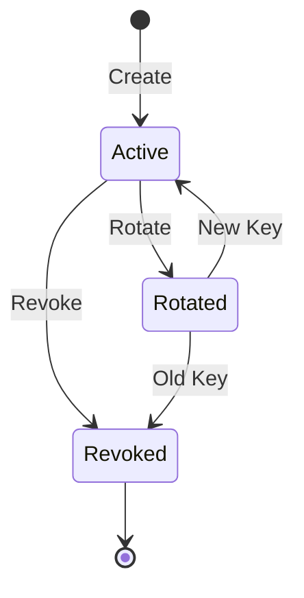

# Authentication

Ricqchet supports two authentication methods:

1. **API Key Authentication** - For programmatic access to relay endpoints (publishing messages)
2. **JWT Authentication** - For user access to management endpoints (user accounts, settings)

## JWT Authentication (Management API)

User accounts authenticate via JWT tokens to access management endpoints like user profile, password changes, and application, API key, and user management.

### First-run admin

Ricqchet is self-hosted and single-organization. There is **no public sign-up** —
the first admin user is created automatically on first run (see
[Configuration → Initial admin](configuration.md#initial-admin)). Sign in with the
printed credentials and change the password immediately.

### User roles & permissions

Every user has one of three roles:

| Role     | View dashboard & data | Manage apps, API keys, channels | Manage users & org settings |
| -------- | :-------------------: | :-----------------------------: | :-------------------------: |
| `admin`  |           ✓           |                ✓                |              ✓              |
| `member` |           ✓           |                ✓                |                             |
| `viewer` |           ✓           |                                 |                             |

Mutating management endpoints return `403 Forbidden` when the user's role is
insufficient. Role checks apply to the JWT-authenticated management API and the
dashboard; the API-key relay endpoints (publish, channels) are unaffected.

### Creating users (admin only)

Admins add users directly — no email is required. Provide a `password`, or omit it
to have a secure one generated and returned **once** in the response.

```bash
curl -X POST "http://localhost:4000/v1/tenant/users" \
  -H "Authorization: Bearer <admin_access_token>" \
  -H "Content-Type: application/json" \
  -d '{"email": "teammate@example.com", "role": "member"}'
```

Response (201 Created) — the one-time `password` is present only when generated:

```json
{
  "id": "...",
  "email": "teammate@example.com",
  "role": "member",
  "status": "active",
  "password": "generated-one-time-password"
}
```

Share the credentials securely; the generated password cannot be retrieved later.
Users can also be managed from the **Team** page in the dashboard.

### Login

Authenticate and receive access and refresh tokens:

```bash
curl -X POST "http://localhost:4000/v1/auth/login" \
  -H "Content-Type: application/json" \
  -d '{
    "email": "user@example.com",
    "password": "secure_password_123"
  }'
```

Response:
```json
{
  "user": {
    "id": "...",
    "email": "user@example.com",
    "role": "admin",
    "status": "active",
    "tenant_id": "...",
    "tenant_name": "My Organization"
  },
  "access_token": "eyJ...",
  "refresh_token": "...",
  "expires_in": 900
}
```

### Using JWT Tokens

Include the access token in the `Authorization` header for protected endpoints:

```bash
curl "http://localhost:4000/v1/users/me" \
  -H "Authorization: Bearer <access_token>"
```

### Token Refresh

Access tokens expire after 15 minutes. Use the refresh token to get a new access token:

```bash
curl -X POST "http://localhost:4000/v1/auth/refresh" \
  -H "Content-Type: application/json" \
  -d '{"refresh_token": "..."}'
```

### Logout

Revoke a refresh token:

```bash
curl -X POST "http://localhost:4000/v1/auth/logout" \
  -H "Authorization: Bearer <access_token>" \
  -H "Content-Type: application/json" \
  -d '{"refresh_token": "..."}'
```

To logout from all sessions, add `"everywhere": true` to the request body.

### Change Password

Change your password (invalidates all existing sessions):

```bash
curl -X POST "http://localhost:4000/v1/auth/change-password" \
  -H "Authorization: Bearer <access_token>" \
  -H "Content-Type: application/json" \
  -d '{
    "current_password": "old_password",
    "new_password": "new_secure_password_456"
  }'
```

New tokens are returned for the current session.

### JWT Security

- Access tokens expire in 15 minutes
- Refresh tokens expire in 7 days
- Password changes invalidate all existing tokens
- Tokens include a version number that's checked against the user's current version

---

## API Key Authentication (Relay API)

API keys are used for programmatic access to message relay endpoints.

## Architecture

```
Tenant (Organization)
  └── Application
        └── API Key(s)
```

- **Tenant**: Top-level organization or account
- **Application**: A project or service within a tenant
- **API Key**: Authentication credential for an application

## Setup

A single default organization (tenant) is created on first run, so you don't
create one yourself. Sign in as the [first-run admin](configuration.md#initial-admin),
then create applications and API keys from the dashboard or the API.

### 1. Create an Application

Create an application from the dashboard (**Applications → New application**) or via
the API (see [Applications](applications.md)). Creating applications requires a
member or admin role.

### 2. Create an API Key

Create a key from the application's detail page in the dashboard, or via the API
(`POST /v1/applications/:id/api-keys`, see below). The plaintext key is only shown
once — store it securely (a secrets manager or environment variable) and never log it.

## Using API Keys

Include the API key in the `Authorization` header:

```bash
curl -X POST "http://localhost:4000/v1/publish/https://example.com/webhook" \
  -H "Authorization: Bearer <your_api_key>" \
  -H "Content-Type: application/json" \
  -d '{"event": "test"}'
```

## API Key Management

API keys can be managed via REST API endpoints. Listing keys is available to any authenticated user, while creating, revoking, and rotating keys require JWT authentication with a member or admin role.

### API Key Lifecycle



### Create API Key

`POST /v1/applications/:application_id/api-keys`

**Requires member or admin role.**

```bash
curl -X POST "http://localhost:4000/v1/applications/{app_id}/api-keys" \
  -H "Authorization: Bearer <jwt_token>" \
  -H "Content-Type: application/json" \
  -d '{"name": "Production Key"}'
```

Response (201 Created):
```json
{
  "id": "550e8400-e29b-41d4-a716-446655440000",
  "name": "Production Key",
  "api_key": "rq_live_abc123def456...",
  "prefix": "rq_live_",
  "status": "active",
  "expires_at": null,
  "created_at": "2026-01-31T15:30:00Z"
}
```

> **Important:** The `api_key` field is only returned in this response. Store it securely - it cannot be retrieved again.

### List API Keys

`GET /v1/applications/:application_id/api-keys`

```bash
curl "http://localhost:4000/v1/applications/{app_id}/api-keys" \
  -H "Authorization: Bearer <jwt_token>"
```

Response (200 OK):
```json
{
  "data": [
    {
      "id": "550e8400-e29b-41d4-a716-446655440000",
      "name": "Production Key",
      "prefix": "rq_live_",
      "status": "active",
      "last_used_at": "2026-01-31T14:00:00Z",
      "expires_at": null,
      "created_at": "2026-01-15T10:00:00Z"
    }
  ],
  "meta": {"total": 1}
}
```

> **Note:** The full API key is never returned in list responses - only the 8-character prefix for identification.

### Revoke API Key

`DELETE /v1/api-keys/:id`

**Requires member or admin role.**

```bash
curl -X DELETE "http://localhost:4000/v1/api-keys/{key_id}" \
  -H "Authorization: Bearer <jwt_token>"
```

Response (200 OK):
```json
{
  "id": "550e8400-e29b-41d4-a716-446655440000",
  "name": "Production Key",
  "prefix": "rq_live_",
  "status": "revoked",
  "revoked": true,
  "revoked_at": "2026-01-31T15:30:00Z"
}
```

> **Warning:** This action cannot be undone. Any requests using this key will immediately fail authentication.

### Rotate API Key

`POST /v1/api-keys/:id/rotate`

**Requires member or admin role.**

Atomically revokes the old key and creates a new one with the same name.

```bash
curl -X POST "http://localhost:4000/v1/api-keys/{key_id}/rotate" \
  -H "Authorization: Bearer <jwt_token>"
```

Response (200 OK):
```json
{
  "old_api_key": {
    "id": "550e8400-e29b-41d4-a716-446655440000",
    "name": "Production Key",
    "prefix": "rq_live_",
    "status": "revoked"
  },
  "new_api_key": {
    "id": "660e8400-e29b-41d4-a716-446655440001",
    "name": "Production Key",
    "api_key": "rq_live_xyz789abc012...",
    "prefix": "rq_live_",
    "status": "active",
    "expires_at": null,
    "created_at": "2026-01-31T15:30:00Z"
  }
}
```

> **Important:** The new `api_key` is only shown once. Update your applications with the new key before the rotation response is lost.

### Programmatic API Key Management

API keys can also be managed via Elixir functions:

```elixir
alias Ricqchet.ApiKeys

# List keys
ApiKeys.list_api_keys_for_application(application)

# Revoke a key
ApiKeys.revoke_api_key(api_key)

# Rotate a key (returns both revoked and new key)
{:ok, {_revoked_key, new_api_key}} = ApiKeys.rotate_api_key(old_api_key)
# Store the new key securely - never log API keys
your_secret_storage.store("api_key", new_api_key.api_key)
```

## WebSocket Authentication (Channels)

Channel WebSocket connections authenticate using API keys passed as socket params during the handshake:

```
wss://api.ricqchet.com/channels?api_key=<key>&user_id=<uid>&user_info=<json>
```

**Parameters:**

| Parameter | Required | Description |
|-----------|----------|-------------|
| `api_key` | Yes | API key for the application |
| `user_id` | No | Unique identifier for the connecting user (default: "anonymous") |
| `user_info` | No | JSON-encoded metadata about the user |

Connections are rejected if the API key is invalid, the application doesn't have `channels_enabled`, or the connection limit has been reached.

For private and presence channels, an additional authorization step calls your configured auth endpoint to verify the user has access.

## Key Expiration

API keys can have an optional expiration date. Expired keys are automatically rejected during authentication.

## Security

- API keys are hashed using Argon2 before storage
- Only an 8-character prefix is stored for O(1) lookup
- Verification uses constant-time comparison to prevent timing attacks
- Keys are scoped to applications, and applications are scoped to tenants
- Inactive tenants or applications will reject all associated API keys

## Tenant Status

Tenants can have the following statuses:

| Status | Description |
|--------|-------------|
| `active` | Normal operation, all API keys work |
| `suspended` | All API requests are rejected |

## Application Status

Applications can have the following statuses:

| Status | Description |
|--------|-------------|
| `active` | Normal operation |
| `inactive` | API keys for this application are rejected |
