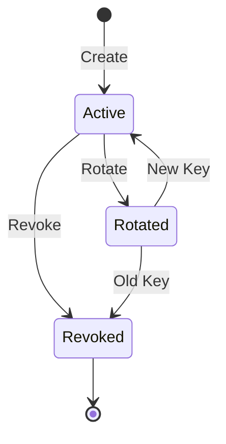

# Authentication

Ricqchet supports two authentication methods:

1. **API Key Authentication** - For programmatic access to relay endpoints (publishing messages)
2. **JWT Authentication** - For user access to management endpoints (user accounts, settings)

## JWT Authentication (Management API)

User accounts authenticate via JWT tokens to access management endpoints like user profile, password changes, and (future) application management.

### Registration

Create a new account with an organization (tenant):

```bash
curl -X POST "http://localhost:4000/v1/auth/register" \
  -H "Content-Type: application/json" \
  -d '{
    "email": "user@example.com",
    "password": "secure_password_123",
    "tenant_name": "My Organization"
  }'
```

A verification email will be sent. Users must verify their email before logging in.

### Email Verification

Verify email using the token from the verification email:

```bash
curl -X POST "http://localhost:4000/v1/auth/verify-email" \
  -H "Content-Type: application/json" \
  -d '{"token": "verification_token_from_email"}'
```

### Login

Authenticate and receive access and refresh tokens:

```bash
curl -X POST "http://localhost:4000/v1/auth/login" \
  -H "Content-Type: application/json" \
  -d '{
    "email": "user@example.com",
    "password": "secure_password_123"
  }'
```

Response:
```json
{
  "user": {
    "id": "...",
    "email": "user@example.com",
    "role": "admin",
    "status": "active",
    "tenant_id": "...",
    "tenant_name": "My Organization"
  },
  "access_token": "eyJ...",
  "refresh_token": "...",
  "expires_in": 900
}
```

### Using JWT Tokens

Include the access token in the `Authorization` header for protected endpoints:

```bash
curl "http://localhost:4000/v1/users/me" \
  -H "Authorization: Bearer <access_token>"
```

### Token Refresh

Access tokens expire after 15 minutes. Use the refresh token to get a new access token:

```bash
curl -X POST "http://localhost:4000/v1/auth/refresh" \
  -H "Content-Type: application/json" \
  -d '{"refresh_token": "..."}'
```

### Logout

Revoke a refresh token:

```bash
curl -X POST "http://localhost:4000/v1/auth/logout" \
  -H "Authorization: Bearer <access_token>" \
  -H "Content-Type: application/json" \
  -d '{"refresh_token": "..."}'
```

To logout from all sessions, add `"everywhere": true` to the request body.

### Change Password

Change your password (invalidates all existing sessions):

```bash
curl -X POST "http://localhost:4000/v1/auth/change-password" \
  -H "Authorization: Bearer <access_token>" \
  -H "Content-Type: application/json" \
  -d '{
    "current_password": "old_password",
    "new_password": "new_secure_password_456"
  }'
```

New tokens are returned for the current session.

### JWT Security

- Access tokens expire in 15 minutes
- Refresh tokens expire in 7 days
- Password changes invalidate all existing tokens
- Tokens include a version number that's checked against the user's current version

---

## API Key Authentication (Relay API)

API keys are used for programmatic access to message relay endpoints.

## Architecture

```
Tenant (Organization)
  └── Application
        └── API Key(s)
```

- **Tenant**: Top-level organization or account
- **Application**: A project or service within a tenant
- **API Key**: Authentication credential for an application

## Setup

### 1. Create a Tenant

```elixir
# In iex -S mix
alias Ricqchet.Tenants

{:ok, tenant} = Tenants.create_tenant(%{name: "My Organization"})
```

### 2. Create an Application

Applications can be created via the API (see [Applications](applications.md)) or programmatically:

```elixir
alias Ricqchet.Applications

{:ok, application} = Applications.create_application(tenant, %{
  name: "Production API",
  description: "Main production service"
})
```

### 3. Create an API Key

```elixir
alias Ricqchet.ApiKeys

{:ok, api_key} = ApiKeys.create_api_key(application, %{name: "Production Key"})

# IMPORTANT: Save this value - it's only shown once!
IO.puts("API Key: #{api_key.api_key}")
```

The plaintext API key is only available immediately after creation. Store it securely.

## Using API Keys

Include the API key in the `Authorization` header:

```bash
curl -X POST "http://localhost:4000/v1/publish/https://example.com/webhook" \
  -H "Authorization: Bearer <your_api_key>" \
  -H "Content-Type: application/json" \
  -d '{"event": "test"}'
```

## API Key Management

API keys can be managed via REST API endpoints (requires JWT authentication with admin role).

### API Key Lifecycle



### Create API Key

`POST /v1/applications/:application_id/api-keys`

**Requires admin role.**

```bash
curl -X POST "http://localhost:4000/v1/applications/{app_id}/api-keys" \
  -H "Authorization: Bearer <jwt_token>" \
  -H "Content-Type: application/json" \
  -d '{"name": "Production Key"}'
```

Response (201 Created):
```json
{
  "id": "550e8400-e29b-41d4-a716-446655440000",
  "name": "Production Key",
  "api_key": "rq_live_abc123def456...",
  "prefix": "rq_live_",
  "status": "active",
  "expires_at": null,
  "created_at": "2026-01-31T15:30:00Z"
}
```

> **Important:** The `api_key` field is only returned in this response. Store it securely - it cannot be retrieved again.

### List API Keys

`GET /v1/applications/:application_id/api-keys`

```bash
curl "http://localhost:4000/v1/applications/{app_id}/api-keys" \
  -H "Authorization: Bearer <jwt_token>"
```

Response (200 OK):
```json
{
  "data": [
    {
      "id": "550e8400-e29b-41d4-a716-446655440000",
      "name": "Production Key",
      "prefix": "rq_live_",
      "status": "active",
      "last_used_at": "2026-01-31T14:00:00Z",
      "expires_at": null,
      "created_at": "2026-01-15T10:00:00Z"
    }
  ],
  "meta": {"total": 1}
}
```

> **Note:** The full API key is never returned in list responses - only the 8-character prefix for identification.

### Revoke API Key

`DELETE /v1/api-keys/:id`

**Requires admin role.**

```bash
curl -X DELETE "http://localhost:4000/v1/api-keys/{key_id}" \
  -H "Authorization: Bearer <jwt_token>"
```

Response (200 OK):
```json
{
  "id": "550e8400-e29b-41d4-a716-446655440000",
  "name": "Production Key",
  "prefix": "rq_live_",
  "status": "revoked",
  "revoked": true,
  "revoked_at": "2026-01-31T15:30:00Z"
}
```

> **Warning:** This action cannot be undone. Any requests using this key will immediately fail authentication.

### Rotate API Key

`POST /v1/api-keys/:id/rotate`

**Requires admin role.**

Atomically revokes the old key and creates a new one with the same name.

```bash
curl -X POST "http://localhost:4000/v1/api-keys/{key_id}/rotate" \
  -H "Authorization: Bearer <jwt_token>"
```

Response (200 OK):
```json
{
  "old_api_key": {
    "id": "550e8400-e29b-41d4-a716-446655440000",
    "name": "Production Key",
    "prefix": "rq_live_",
    "status": "revoked"
  },
  "new_api_key": {
    "id": "660e8400-e29b-41d4-a716-446655440001",
    "name": "Production Key",
    "api_key": "rq_live_xyz789abc012...",
    "prefix": "rq_live_",
    "status": "active",
    "expires_at": null,
    "created_at": "2026-01-31T15:30:00Z"
  }
}
```

> **Important:** The new `api_key` is only shown once. Update your applications with the new key before the rotation response is lost.

### Programmatic API Key Management

API keys can also be managed via Elixir functions:

```elixir
alias Ricqchet.ApiKeys

# List keys
ApiKeys.list_api_keys_for_application(application)

# Revoke a key
ApiKeys.revoke_api_key(api_key)

# Rotate a key
{:ok, new_api_key} = ApiKeys.rotate_api_key(old_api_key)
IO.puts("New API Key: #{new_api_key.api_key}")
```

## Key Expiration

API keys can have an optional expiration date. Expired keys are automatically rejected during authentication.

## Security

- API keys are hashed using Argon2 before storage
- Only an 8-character prefix is stored for O(1) lookup
- Verification uses constant-time comparison to prevent timing attacks
- Keys are scoped to applications, and applications are scoped to tenants
- Inactive tenants or applications will reject all associated API keys

## Tenant Status

Tenants can have the following statuses:

| Status | Description |
|--------|-------------|
| `active` | Normal operation, all API keys work |
| `suspended` | All API requests are rejected |

## Application Status

Applications can have the following statuses:

| Status | Description |
|--------|-------------|
| `active` | Normal operation |
| `inactive` | API keys for this application are rejected |
